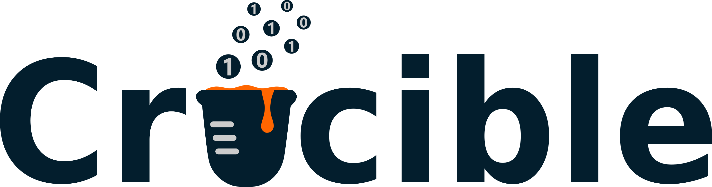

  

Android app for browsing and scanning samples and datasets from the [Molecular Foundry](https://foundry.lbl.gov/)'s Crucible data system.

## Features

- 📷 QR code scanning and manual UUID lookup
- 🔍 Full-text search across cached samples and datasets
- 📁 Project browser with pinning and archiving
- 📊 Sample and dataset detail views with swipe-based sibling navigation
- 🖼️ Dataset thumbnails and scientific metadata explorer
- 🔗 Parent/child relationship navigation and Graph Explorer integration
- 📤 Share cards with embedded QR code
- 🕐 Browsing history and last-visited shortcut
- 🌙 Light/dark theme with accent color picker

## Requirements

- Android 8.0 (API 26) or higher
- Crucible API key — [get yours here](https://crucible.lbl.gov/api/v1/user_apikey)

## Setup

1. Clone and open in Android Studio
2. Build and install the APK
3. Open the app → Settings → Enter your API key

## Tech Stack

Kotlin · Jetpack Compose · Material 3 · CameraX · ML Kit · Retrofit · Moshi · Coil

## License

BSD-3-Clause — developed by the Data Group at the [Molecular Foundry](https://foundry.lbl.gov/), Lawrence Berkeley National Laboratory.
