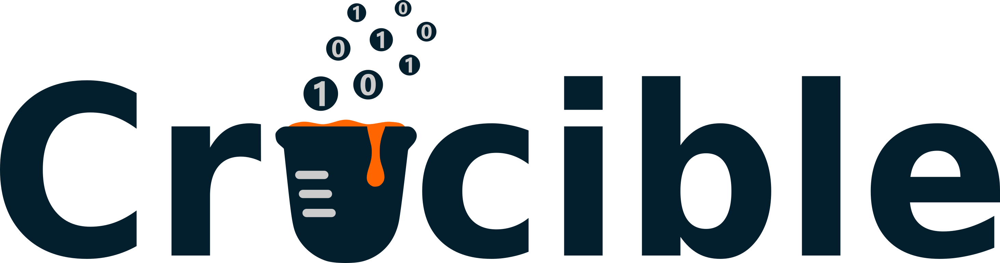

  

Android + iOS app (Kotlin Multiplatform + Compose Multiplatform) for browsing, creating, and managing samples, datasets, and projects from the [Molecular Foundry](https://foundry.lbl.gov/)'s Crucible data system.

## Features

- QR code scanning and manual UUID lookup
- Search across samples, datasets, projects, and people, with server-side scientific metadata
  search and quick category filters
- Project browser with pinning, offline sync, and member/join-request management
- Create and edit samples, datasets, and projects; add colleagues to a project from search or
  their profile
- Instrument browser with search, pinning, and per-instrument dataset listing
- Sample and dataset detail views with swipe-based sibling navigation
- Dataset thumbnails and scientific metadata viewer
- Parent/child relationship navigation and Crucible Web integration
- QR code sharing for any resource
- Browsing history and last-visited shortcut
- Light/dark theme with accent color and contrast picker, plus Android 12+ dynamic color
- ORCID sign-in

## Requirements

- Android 8.0 (API 26) or higher
- Crucible account ([get yours here](https://crucible.lbl.gov/explore/))

## Installation

### For users

Crucible Lens is currently in **closed testing** on the Play Store.

1. Request access via email at [crucible-dev@lbl.gov](mailto:crucible-dev@lbl.gov) or on our [Discord](https://discord.gg/YapVkx7HhW) channel
2. Once added as a tester, opt in at the [testing link](https://play.google.com/apps/testing/gov.lbl.crucible)
3. Install/update from the [Play Store listing](https://play.google.com/store/apps/details?id=gov.lbl.crucible)
4. Launch the app > **Settings > Account** > login via ORCID or enter your API key

Every tagged version is also published on the [Releases](../../releases) page. If you prefer sideloading the APK, you can download it, allow "Install unknown apps" for your browser or file manager, and open the downloaded file to install it directly.

### For developers

1. Clone the repository
2. Open in Android Studio with support for AGP 9.x (see `gradle/libs.versions.toml` for the exact toolchain versions)
3. Let Gradle sync complete
4. Build the installable app with `:androidApp:assembleDebug` (see `AGENTS.md` for exact commands)
5. Run on a device or emulator (API 26+)
6. On first launch, go to **Settings > Account** and login via ORCID or enter your API key

iOS builds require Xcode on macOS — see `dev/platform-parity.md`.

## Tech Stack

Kotlin Multiplatform · Compose Multiplatform · Material 3 · Ktor · kotlinx.serialization · Koin · CameraX / ML Kit (QR scanning) · Coil

## Privacy

See the [privacy policy](https://roncofaber.github.io/crucible-lens/privacy/) ([source](PRIVACY.md)) for what data the app accesses and how it's used.

## License

[BSD-3-Clause](LICENSE).

Crucible Lens is an open-source project built by contributors to Crucible, published and maintained by [@roncofaber](https://github.com/roncofaber). It is not an official product of, and is not endorsed or supported by, the [Molecular Foundry](https://foundry.lbl.gov/), Lawrence Berkeley National Laboratory, the University of California, or the U.S. Department of Energy. "Crucible" and "Molecular Foundry" are used here only to identify the system this app connects to.
